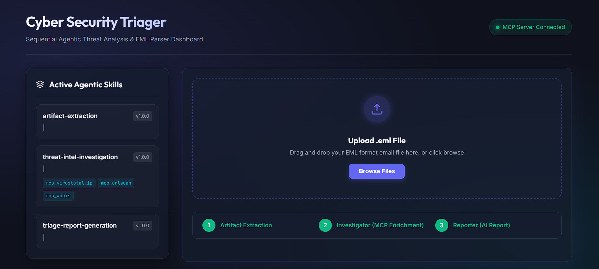
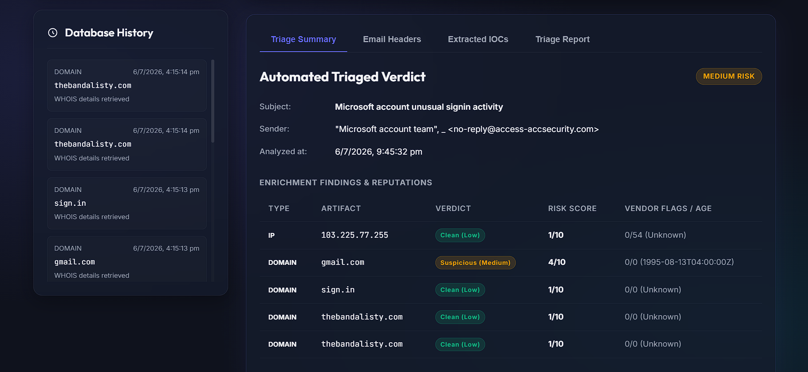
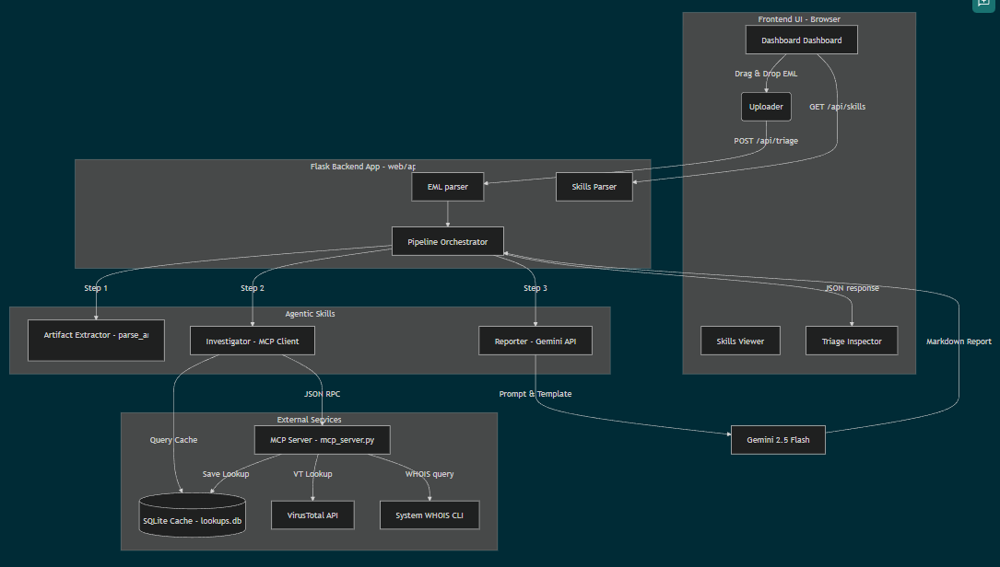

# Cyber Security Triager - Sequential Agentic Threat Analysis & e-mail parser

## Track : Freestyle




## Overview

**Cyber Security Triager and e-mail Parser Project** is a modern web application built for cybersecurity triage and incident management. It provides a sleek, glassmorphism‑styled dashboard that presents real‑time alerts, threat intelligence, and actionable insights. The backend is powered by Python, leveraging a lightweight MCP server for handling API requests and a Flask‑based web interface.

- **`mcp_server.py`** – Implements the MCP (Modular Component Platform) server for extensible plugin handling.
- **`web/app.py`** – Flask application that serves the UI and API endpoints.
- **`web/templates/index.html`** – Jinja2 template for the responsive front‑end.

The project emphasizes a premium user experience with smooth micro‑animations.

## High Level Architecture Diagram



## Features

- analyzing phishing emails and scams via modern dashboard. 
- Modular plugin architecture via MCP.
- downloadable threat reports and summaries.
- Responsive design with modern CSS (glassmorphism, gradients, subtle hover effects).
- Easy extensibility for adding new security data sources.

## Getting Started

```bash
# Clone the repository
git clone https://github.com/anikkcah/CyberSecurity_Triager.git
cd CyberSecurity_Triager

# Install dependencies (example using pip)
python -m venv venv
source venv/bin/activate  # on Windows: venv\Scripts\activate
pip install -r requirements.txt

# Run the web application server locally ( or can deploy in Google Cloud )
python web/app.py
```
open your browser and access localhost with the mentioned port number.

## Contributing

Contributions are welcome! Please fork the repository, create a feature branch, and submit a pull request. Follow the code style guidelines and ensure all tests pass.

## License

This project is licensed under the MIT License – see the `LICENSE` file for details.

## Note on API keys:
 save the Virus Total API key as an environmental variable "VT_API_KEY" and use it in the project. 
