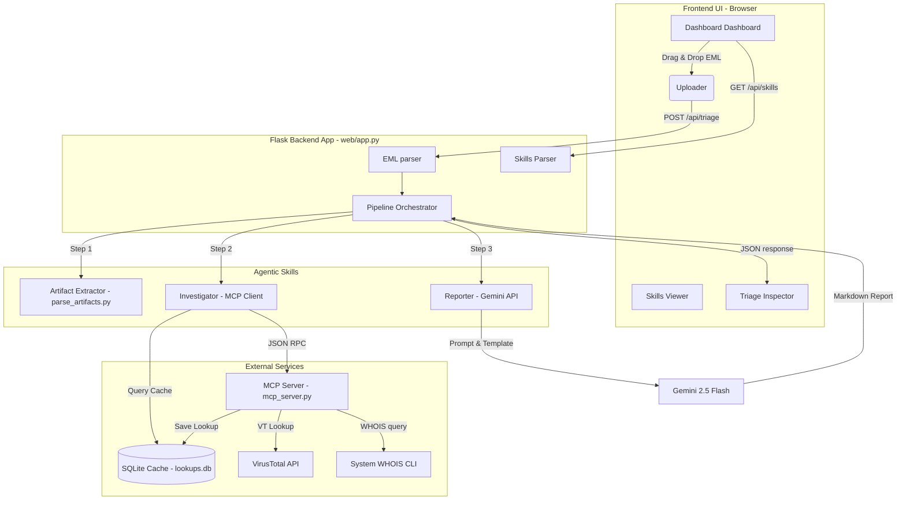
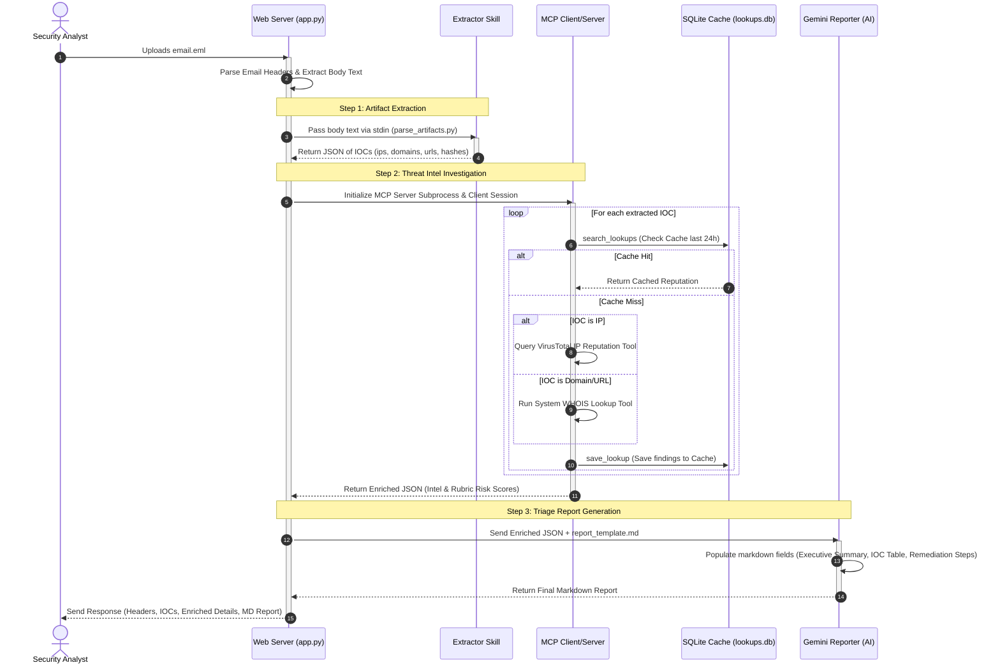

# Cyber Security Triager - Architecture & Flow Walkthrough

This document outlines the architecture, components, and data flow of the **Cyber Security Triager** web application, showcasing how the sequential agentic skills pipeline operates.

---

## 1. High-Level Architecture

The application is structured into three main layers: the **Frontend Dashboard**, the **Flask Web App Controller**, and the **Model Context Protocol (MCP) Server**. A local **SQLite Cache** handles past lookup histories and acts as an agentic memory cache.

---

## 2. Sequential Pipeline Data Flow

When a security analyst uploads an `.eml` file, the backend processes it sequentially through the defined agentic skills:

---

## 3. Core Component Breakdown

### 📂 1. Agentic Skills Definitions
The application reads **Yaml frontmatter** from the `SKILL.md` files in the project to dynamically present information on the dashboard:
*   **`artifact_extraction`**: Extracts IPs, domains, URLs, and hashes. Leverages `scripts/parse_artifacts.py`, a deterministic script that parses raw strings via optimized regex patterns.
*   **`threat_intel_investigation`**: Queries cache and external APIs. Governed by a reputational rubric mapped from VirusTotal votes and WHOIS domain ages to risk levels (`LOW`, `MEDIUM`, `HIGH`, `CRITICAL`).
*   **`triage_report_generation`**: Generates the final Incident Report utilizing `assets/report_template.md` as the template filled by Gemini.

### 🌐 2. FastMCP Server (`mcp_server.py`)
A model-context protocol server that exposes standard interfaces (tools) to the backend agent:
1.  `search_lookups(query)`: Performs SQL checks inside `lookups.db` to prevent double-querying external APIs.
2.  `virustotal_ip_lookup(ip_addr)`: Hits the VirusTotal API using the `VT_API_KEY` to collect malicious votes and owner information.
3.  `whois_lookup(domain)`: Queries domain registrar creation dates.
4.  `save_lookup(ioc_type, artifact, results)`: Commits lookup items with timestamps.

### 🎨 3. Dashboard Interface (`web/templates/index.html`)
An analyst-centric workspace styling vanilla CSS custom properties:
*   **Stepped Progress Tracker**: Visual representation of the three sequential steps lighting up as the backend finishes processing.
*   **Email Headers & Hop Map**: Decodes authentication checks (SPF/DKIM/DMARC) and renders hops sequentially.
*   **Extracted IOC Badges**: Dynamic chips displaying indicators by categories.
*   **Triage Report Canvas**: Embedded markdown report converted to rich HTML in real time with quick-action export buttons (copy markdown or download report).
